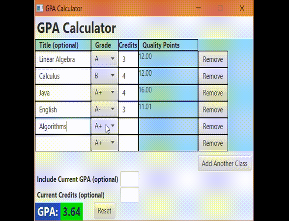

# GPA Calculator
A GPA calculator in JavaFX attempting to use the [**Model View Controller** (MVC) pattern](https://en.wikipedia.org/wiki/Model%E2%80%93view%E2%80%93controller)

## **[Download Latest Release](https://github.com/SleekPanther/gpa-calculator/releases/latest)**

## Features
- **Dynamically recalculates GPA when any information is changed**
- Calculate GPA for specific classes
- Add and remove classes
- Optionally include your existing GPA to see how the current semester affects it
- Input validation

## GPA Explanation
A GPA is simply a weighted average. You can see more examples on [UVM's help page](https://www.uvm.edu/~rgweb/?Page=gradesandtranscripts/g_gpa.html&SM=g_menu.html)  
The calculate GPA, you multiply the number of credits by the numerical grade for a class and divide by the total credits

## Grade Equivalents
|Grade|Calue|
|-|-|
|A+|4.0|
|A|4.0|
|A-|3.67|
|B+|3.33|
|B|3.0|
|B-|2.67|
|C+|2.33|
|C|2.0|
|C-|1.67|
|D+|1.33|
|D|1.0|
|D-|0.67|
|F|0.0|

## Rounding Issues
When including your current GPA, this program may yield a total GPA that's off by 0.01. This is because your school may round up or down when calculation your overall GPA and including your Overall GPA may be slightly different than entering all the classes individually.

UVM rounds down when calculating your overall GPA. Thus 3.5995 is just 3.59 and not 3.60. This program also reflects that convention even if it's not mathematically equivalent.

## References
- [JavaFX Java GUI Tutorial - 31 - Introduction to FXML](https://youtu.be/K7BOH-Ll8_g) Bucky FXML
  - [JavaFX Java GUI Tutorial - 32 - Controllers in FXML](https://www.youtube.com/watch?v=LMdjhuYSrqg)
  - [031_fxml Github code](https://github.com/buckyroberts/Source-Code-from-Tutorials/tree/master/JavaFX/031_fxml) Bucky Github sample
- [Is @FXML needed for every declaration? - Stack Overflow](http://stackoverflow.com/a/30213067) `@FXML` annotation
  - [JavaFX FXML Controller Example - Java Code Geeks](https://examples.javacodegeeks.com/desktop-java/javafx/fxml/javafx-fxml-controller-example/) more on @FXML
  - [Introduction to FXML](https://docs.oracle.com/javafx/2/api/javafx/fxml/doc-files/introduction_to_fxml.html#fxml_annotation) javadox `@FXML`
- [JavaFX 2 Event Handlers and Change Listeners](http://code.makery.ch/blog/javafx-2-event-handlers-and-change-listeners/#textbox-events) `TextField` events (long way)
  - [How get an event when text in a TextField changes? JavaFX - Stack Overflow](http://stackoverflow.com/a/30161053) Lambda Expressions
  - [Value Change Listener for JavaFX's TextField - Stack Overflow](http://stackoverflow.com/a/30161053) more lambda
- [JavaFX FXML controller - constructor vs initialize method - Stack Overflow](http://stackoverflow.com/a/34785707) 
- [Setting stylesheets declaratively in FXML - Stack Overflow](http://stackoverflow.com/a/14697202) **WORKS!**
  - [How to add a CSS stylesheet in FXML - Stack Overflow](http://stackoverflow.com/a/28123426) complex
- [Set multiple styleClass values - Stack Overflow](http://stackoverflow.com/a/25564361) css class (style**C**lass must be **C**apitalize)
- [Connecting SceneBuilder edited FXML to Java code](http://code.makery.ch/blog/javafx-8-event-handling-examples/) javafx FXML event handling
- [JavaFX css width - Stack Overflow](http://stackoverflow.com/a/29096857) `-fx-pref-width`, `-fx-min-width`,  `-fx-max-width`
  - **[JavaFX CSS Reference](https://docs.oracle.com/javafx/2/api/javafx/scene/doc-files/cssref.html) `Ctrl+F` -fx-pref-width**
- [Java-Buddy: Create GridPane using FXML](https://java-buddy.blogspot.com/2012/05/create-gridpane-using-fxml.html) `FXML GridPane`
- [RequestFocus() in TextField doesn't work](http://stackoverflow.com/a/38900429) Run after `initialize()` is done:  
also via lambda: `Platform.runLater(()->class1Grade.requestFocus());`
- [JavaFx TextField focus lost formatting](http://stackoverflow.com/a/25975373) ChangeListener for `onBlur()` (leave `TextField`)  
but only for TextField, not another label
- 
- December 2017 Links
- [StackOverflow - ChoiceBox/ComboBox populate from ArrayList](https://stackoverflow.com/a/34288533/8050097)
- [GitHub - ComboBox FXML example](https://gist.github.com/jewelsea/3062859)
- [Bucky - ComboBox](https://www.youtube.com/watch?v=Bg5VcIL2IhY)
- [Bucky - ChoiceBox](https://www.youtube.com/watch?v=K3CenJ2bMok) (didn't use since arrows keys don't change choices)
- [Bucky - Dropdown Selection Changes](https://www.youtube.com/watch?v=WZGyP57IH6M)
-
- [StackOverflow - What is the recommended way to make a numeric TextField in JavaFX?
](https://stackoverflow.com/a/30796829/8050097) Integer TextField validation
- [StackOverflow - JAVAFx TextField Validation Decimal value](https://stackoverflow.com/a/45495631/8050097) **Decimal** TextField validation
- 
- [How to Use the Focus Subsystem](https://docs.oracle.com/javase/tutorial/uiswing/misc/focus.html) Meant for Swing, but similar in JavaFX
- [Remove a row from a GridPane](https://stackoverflow.com/a/40517410/8050097) Remove row from GridPane method
-
- [StackOverflow - JavaFX getting scene from a controller](https://stackoverflow.com/a/26061123/8050097) Get containing `Scene` from GUI object
- [StackOverflow - JavaFX: How to get stage from controller during initialization?](https://stackoverflow.com/a/31686775/8050097) Get containing `Stage` from GUI object
- **[Java2s - stage.sizeToScene()](http://www.java2s.com/Code/Java/JavaFX/sizeToScene.htm) Rezie stage to scene size**
-  
- **[Youtube - MVC Java Tutorial](http://www.newthinktank.com/2013/02/mvc-java-tutorial/) *Great video*, provided the main motivation to use MVC, but it uses *Java swing* and I had to adapt it to *JavaFX***
  - [UI Control Sample - JavaFX Tutorials and Documentation](https://docs.oracle.com/javafx/2/ui_controls/ButtonSample.java.html) Finally just copied the stuff inside `setOnAction()` to separate inner class in **Controller**
  - [Handling JavaFX Events: Processing Events | JavaFX 2 Tutorials and Documentation](https://docs.oracle.com/javafx/2/events/processing.htm)
  -  
  - **Dead ends**
  - [JavaFX separating event handling from controller class - Stack Overflow](http://stackoverflow.com/q/36663988) not enough details
  - [javafx multiple buttons to same handler - Stack Overflow](http://stackoverflow.com/a/25410169) initial thougts, but didn't pan out
  - [Multiple Buttons To Same Action Listener](http://www.dreamincode.net/forums/topic/234827-multiple-buttons-to-same-action-listener/#entry1357573) right idea, but using ActionListener instead of EventHandler
  - [JavaFX 8 Event Handling Examples](http://code.makery.ch/blog/javafx-8-event-handling-examples/) JavaFX button handing and much more
  - [4 Working with Event Handlers](https://docs.oracle.com/javafx/2/events/handlers.htm) `addEventHandler()`
  - [Difference between setOnXXX() method and addEventHandler() JavaFx - Stack Overflow](http://stackoverflow.com/q/37821796)
  - [Handling Events with Listeners - vaadin](https://vaadin.com/docs/-/part/framework/application/application-events.html) anonymous inner classes
- [StackOverflow - Applying MVC With JavaFx](http://stackoverflow.com/a/32343342)
- [Stack Overflow - javafx: Separate EventHandler and gui code](http://stackoverflow.com/a/35659515)
- Less Helpful
- [Youtube - JavaFX Software Tutorial: Calculator (MVC)](https://www.youtube.com/watch?v=y1ZaBalVZic) long
- [Youtube - JavaFX Software: Alarm Clock (MVC)](https://www.youtube.com/watch?v=wIpgGpmFUjA)

https://gjf2a.blogspot.com/2015/01/dynamically-adding-javafx-controls.html
